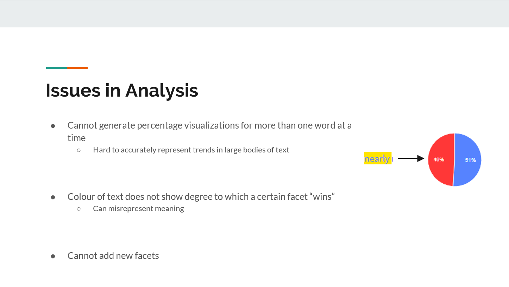

# IASC 2P02 | Nikolas Carson

## Bio

I am a third year Interactive Arts and Science student primarily focused on Media Archeology and the ways this topic can be represented, both through graphics and text. I am fascinated by analysis of media artifacts of the past and how they have impacted the media of the present. My featured project is an example of my media archeological work, exploring the history of wearable technologies through the Xybernaut wearable computers of the early 2000s. As media archeology is a broad, interpretive field, the ways in which this research is represented should reflect that, while still being clear and legible. This is the topic I tackle in my academic blog post, which deals with the form of interpretive graphical displays within the digital humanities. This is a response to an article by Johanna Drucker, who argues that graphics should be heavily interpretive – where as I argue for a compromise between clarity and subjectivity. My collaborative project explores PRISM, a tool for collaborative interpretation of text. The PRISM tool is useful for group interpretation of the types of content created for the technologies that I discuss in my work as a media archeologist, which can reveal much about the technology's function and impact. As media evolves, the need for media archeologists grows. In the future, I plan to cast an archeological lens on video game consoles and home PCs.

## Featured Project | Media Archeology Research Presentation: Xybernaut Wearable Computers

250 word abstract goes here

250 words describing the changes made

Media Archeology: Xybernaut Wearable Computers | [read](reveal)

## Academic Blog | Graphical Displays in the Digital Humanities

Graphical Displays in the Digital Humanities: Clarity vs Interpretation | [read](blog)

## Research Presentation | Media Archeology

Xybernaut Wearable Computers | [read](reveal)

## Collaborative Project | PRISM

This project explores the collaborative text interpretation tool called PRISM. In it, my group and I outlined the functionality of the tool, describing how it achieves the goal of letting multiple users interpret a single body of text. We then performed research that displayed this functionality through creating our own prism, an analysis of the lyrics to "Chop Suey!" by system of a down. We then used this example to illustrate the ways in which the tool's functionality can relate to the work of prominent scholars in the digital humanities; an example being Johanna Drucker's take on complex, interpretive graphics. 

Collaborative research, specifically in an emerging field such as the digital humanities, provides many challenges and benefits. Being able to bounce ideas off of others acts as a good filter for poor quality work, and enriches the thinking of all involved. The recent trend for group work in a scholarly setting is to do a quick, almost careless delegation of tasks at the outset of a project, allowing members to work alone from that point onward. This is further shown by the development of online collaborative tools, such as google docs and messenger group chats. However, I believe that this approach can have negative effects on the quality of the final project, making it feel disjointed and rushed. In the process of creating this project, we wanted to fully discuss and establish what the final project would look like, in person, before separating to do individual research. This came in the form of discussing how we would describe the PRISM tool, what we could use as a holistic example to display it's functionality, and how this functionality reflected a more theoretical discussion relating to the ideas of scholars in the digital humanities. We established early on that we would use a song as an example, as it was relatable and simple (shown below).

We also made it known to each other that we would be connecting the tool to Johanna Drucker's work on interpretive graphics, allowing for a more cohesive presentation. With this done, we were able to work individually with confidence that the final product would make sense internally. An example of this internal consistency is seen through a slide I made which connects to our theoretical discussion, seen below.

Once our individual tasks were complete, we got together the day of the presentation to rehearse, and clear up any inconsistencies that may exist between our work. This also allowed us to help each other in providing our individual deliverables through GitHub, as this was a source of confusion for some. Through this approach to collaboration, we were able to create something of good quality that also helped us develop individually. 

My individual contribution to the project can be seen [here](https://github.com/IascAtBrock/IASC-2P02-TeamPresentations/commit/a11ebcdbb8674180bf9bc7c22f58596be232d693)

