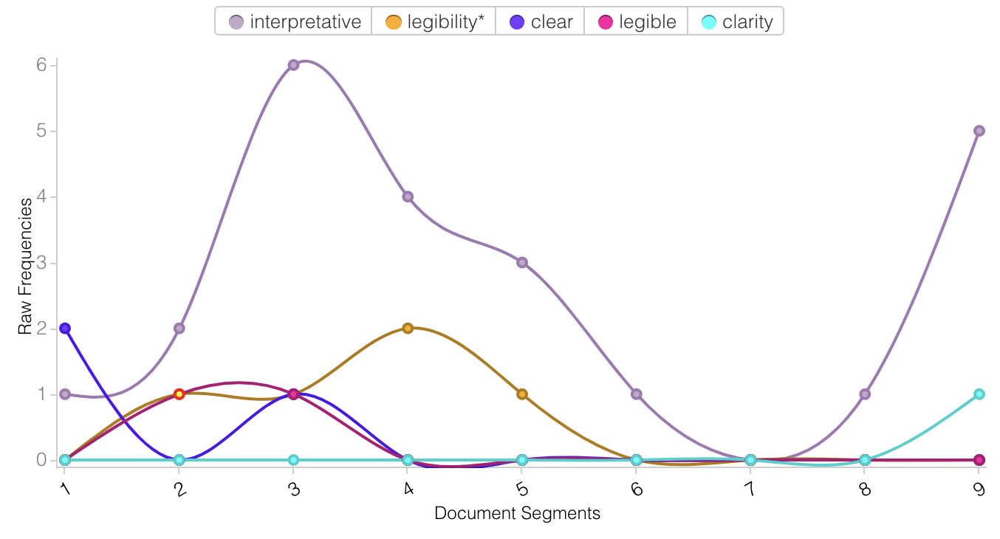

# Graphical Displays in the Digital Humanities: Clarity vs Interpretation 

  The field of the Digital Humanities, as described by Alvarado (2011), is defined by “the ongoing, playful encounter with digital representation”. While the exploratory nature of the discipline lends itself well to this lighthearted characterization, it also brings with it a problem – individuals can get carried away with pleasing new ideas, taking them beyond what is reasonable or useful. One such article which has exhibited this is “Humanities Approaches to Graphical Display” by Johanna Drucker.  Drucker’s argument in this piece is that digital visualization tools such as graphs and charts are artifacts better suited to other, more scientific disciplines, and that they do not suit the interpretive nature of the digital humanities. Drucker suggests changes in form to these tools to align them more effectively with the goals of the field, and allow for subjective viewing. I will argue, however, that in doing so, Drucker has lost sight of the purpose of these tools in the first place; which is to provide a clear and easily digestible representation of a set of data. 

	Drucker begins to illustrate her point about the need for interpretive graphics through a pair of figures comparing gender totals between different nations. The problem used to describe this need is that of the distinction of gender; “Gender definition assumes a simple binary distinction of men and women, an assumption much debated and highly problematic” (Drucker, 2011). While this is an important issue not currently represented through current data visualizations, it can be seen in her suggested interpretive graphic that problems in clarity arise. Points and patterns seem to change in location and size somewhat arbitrarily – requiring lengthy written descriptions to be understood. If such a description is needed for the graphic to be legible, it would seem that simply describing the data through text alone would be more effective. The issue of clarity in Drucker’s experimental graphics is continued throughout, with little attention being payed to it as a potential barrier to their success. This is shown in the use of a text analysis tool which describes how often she uses terms that deal with clarity. 

  The prospective visualizations used by Drucker also highlight an issue specifically within the scholarly field of the Digital Humanities — by making graphics that are more subjective in nature, it becomes much harder to communicate a cohesive, multimodal argument in an article. A scholar may intend for a specific graphic to be viewed in a way that supports the points they are making, but viewers may not see it in the same way, either negating its usefulness as support for an argument or even contradicting the argument.  This can be illustrated through Drucker’s visualizations of an event reaching a crisis due to a number of stress factors. For example, the vortex graphic could be interpreted both as an increase or decrease in stress depending on the viewer’s interpretation of what a vortex indicates — some may interpret it as being the point at which stresses converge and combine, or it could be interpreted as the point at which they disappear. This idea is also illustrated when Ramsay (2011) states:

  If something is known from a word frequency list or a data visualization, it is undoubtedly a function of our desire to     make sense of what has been presented. We fill in gaps, make connections backward and forward, explain inconsistencies,     resolve contradictions, and, above all, generate additional narratives in the form of declarative realizations (p.62). 
  
In making graphics more open to interpretation, it is easy to inadvertently weaken or confuse the arguments they support as a result of the different views of every reader. However, the strength of these graphics is also highlighted here in that they can create additional narratives and discussion, provided they are clear and legible. 

	If it is established that interpretive graphics are useful, but not in the way that Drucker primarily displays, the issue then becomes whether or not it is possible for them to be created effectively. I would argue that the optimal way to do this is through a combination of graphics and text — as I have already established that they require lengthy descriptions to be understood. This may mean that a larger legend is necessary, or that text be integrated in the graphics themselves. As Ciula and Marras (2016) believe, this use of language, when given a prominent role, can be more useful for the digital humanities:
  

  In describing their modelling activities DH researchers tend to privilege a symbolic analysis of texts instead of a         pragmatic. The former view on text focuses on partitioning it into descriptive chunks or components… while the latter…       calls for an integrative approach where the use of language in understanding and manipulating texts is given a prominent     place (p.2).

  
Although they refer to the use of text alongside text modelling practices, the same logic can be applied to its use with graphic representations of data. Drucker’s one graphic that exemplifies this is shown in figure 6 of her article, describing the activities in a day and how they create the form of a day. It appears to have the most immediately obvious meaning of all her graphics, and can support multiple conclusions – due to the way in which it displays text visually and integrates it into the graphic.
  
	While Drucker raises relevant points about the need of interpretive data representations in the digital humanities, most examples she uses are insufficient due to a lack of clarity, which can confuse their interpretation. For graphical displays in the digital humanities to truly find their place, further development and iteration is still needed.  
